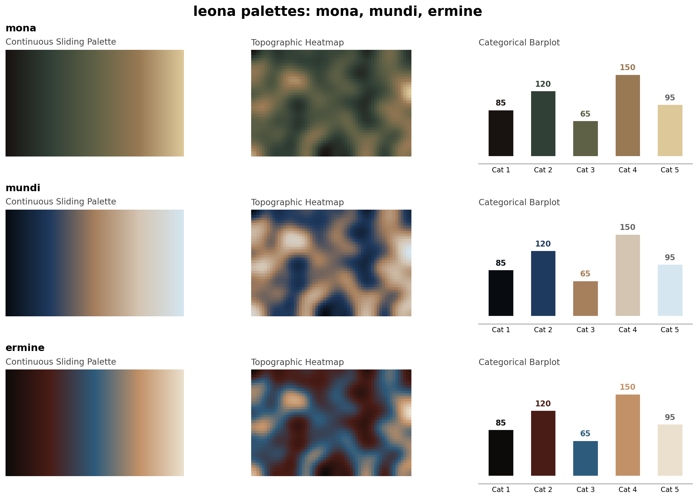
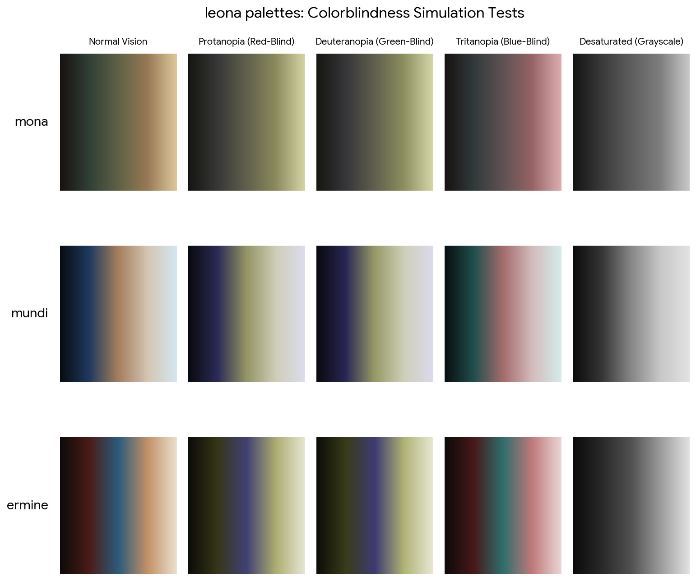

# leona

**Perceptually uniform, colorblind-safe colormaps extracted from the Renaissance.**



`leona` is a suite of scientifically rigorously engineered colormaps derived directly from the color spaces of great masterworks. While they originated on canvas, these palettes have been mathematically re-projected to ensure strictly monotonically increasing lightness.

Like other modern, scientifically optimized scales, the `leona` palettes are designed to improve graph readability for readers with common forms of color blindness and/or color vision deficiency. They are perceptually-uniform, both in regular form and also when converted to black-and-white for printing.



### The Suite

* **`mona`**: Earthy, organic, and beautifully muted. Ideal for continuous topographic surfaces.
* **`mundi`**: High contrast and dramatic. A massive luminance sweep from deep space black to lapis blue, culminating in an icy, ethereal white.
* **`ermine`**: Incredibly rich and saturated. The velvet crimson transition provides exceptional categorical distinction while maintaining monotonic lightness.

### The Science: Why these work

The human visual system is fundamentally more sensitive to changes in luminance (brightness) than changes in hue. The old masters understood this intuitively, structuring their masterworks around massive, sweeping contrasts in lightness (chiaroscuro) while selecting hues that act as orthogonal "principal components" of the visual spectrum.

Because of this optimal coarse-graining of the color space, values close to each other have similar-appearing colors and values far away from each other have more different-appearing colors, consistently across the range of values.

This ensures that the `leona` palettes are robust to colorblindness, so that the above properties hold true for people with common forms of colorblindness, as well as in grey scale printing.

## Install

```bash
pip install leona            # core: numpy + matplotlib
pip install "leona[preview]" # adds scipy, needed only for leona.preview()
```

Or drop `leona/__init__.py` next to your code as a single-file module.

## Use it like viridis

On import the colormaps register with matplotlib, so the **string names work
exactly like the built-ins**:

```python
import leona
import matplotlib.pyplot as plt

plt.imshow(data, cmap="mona")      # by registered name
plt.imshow(data, cmap="mundi_r")   # reversed
plt.imshow(data, cmap=leona.mona)  # or pass the object directly
```

Each palette ships with a reversed `_r` variant (`mona_r`, `mundi_r`, `ermine_r`).

Helpers:

```python
leona.list_palettes()   # ['mona', 'mundi', 'ermine']
leona.get("ermine")     # -> LinearSegmentedColormap
leona.PALETTES["mona"]  # the raw hex stops
leona.register()        # re-register manually (auto-runs on import)
```

## Hex stops

```text
mona     #181211  #314036  #5F6146  #987954  #DDC89A
mundi    #080C11  #1F3A5F  #A67F5D  #D4C5B3  #D5E6F0
ermine   #0D0B0A  #4A1C16  #2D5B7C  #C29167  #EBE0CE
```

## Showcase figure

```python
import leona
leona.preview(save="leona_palettes.png")
```

Renders a 3×3 grid (continuous ramp, heatmap, categorical barplot) for each
palette. Requires the `preview` extra (scipy).

## Notes on intended use

These are **sequential** colormaps, monotone in lightness. That makes them a
good default for magnitude / density / topographic data and keeps ordering
intact under CVD and grayscale. Because the lightness ramp has no interior
extremum, they are **not** suitable as diverging maps — a CVD or grayscale
reader cannot locate a midpoint by brightness, so don't map them to signed
anomalies where "zero" must read as a neutral pivot.

## License

MIT.
